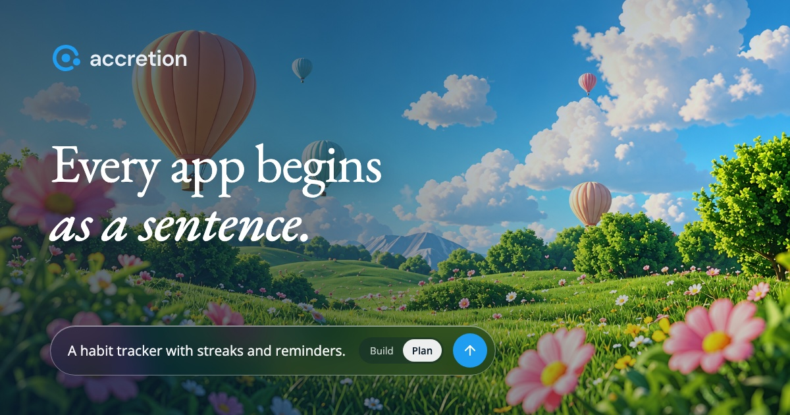

<div align="center">

<picture>
  <source media="(prefers-color-scheme: dark)" srcset="frontend/public/brand/accretion-lockup-dark.svg">
  
</picture>

### Every app begins as a sentence.

Describe an app in plain words. Accretion plans it with you, then builds the whole thing:
the screens, the server and a real database.

[How it works](#how-it-works) · [Run it locally](#run-it-locally) · [Starter apps](sandbox/README.md)

<br>



</div>

## What you get

- **A plan before any code.** Your first message comes back as a plan in your own words. Change it, approve it, then it builds.
- **A full app, not a mockup.** Frontend, API and database, in the stack you name or one it picks for you.
- **Checked like a person would.** Every change is clicked through in a real browser, on desktop and phone, before you see it.
- **Yours to keep.** Read every file, edit it yourself, or download the whole project and run it anywhere.
- **Ask, don't just build.** Questions about your app get answers from its actual code, without touching it.

## How it works

1. **Describe it.** Type what you want, the way you would tell a friend.
2. **Review the plan.** Read what you'll get. The technical steps stay folded until you want them.
3. **Watch it build.** Approve, and each step is built, checked in the browser and ticked off. Keep chatting to change anything.

## Run it locally

You need Docker, Python 3.12+ with [uv](https://docs.astral.sh/uv/), Node.js 22+ and make.

```bash
cp .env.example .env                              # add E2B_API_KEY, SECRET_KEY and one model key
cp frontend/.env.example frontend/.env.local
uv sync && npm --prefix frontend ci
make template-build                               # your own sandbox image with every starter app

docker compose up -d --build --wait               # database and file storage
make backend                                      # http://localhost:8000
make frontend                                     # http://localhost:3000
```

Open http://localhost:3000 and create an account.

<div align="center">
<sub>Built with Next.js, FastAPI and E2B.</sub>
</div>
